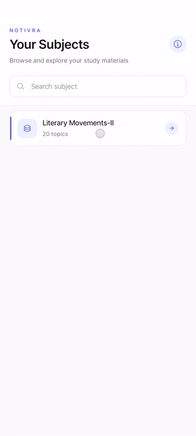

# 📚 Notivra

Notivra is a React Native and Expo app that provides **NEP syllabus-based notes** in a simple and organized format. Students can browse subjects, explore topics, and read notes easily on mobile devices.

## ✨ Features

- Subject-wise notes
- Topic-wise organization
- NEP syllabus focused
- Clean and easy-to-use interface
- Android & iOS support

## 🎥 Demo



## 🛠️ Tech Stack

- React Native
- Expo
- Uniwind
- JavaScript/TypeScript
- Axios (API requests)

## 🚀 Run Locally

```bash
npm install
npx expo start
```
